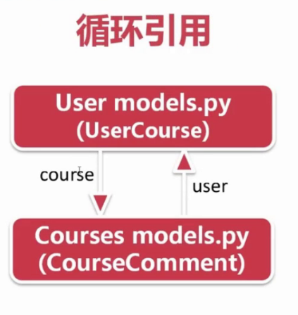
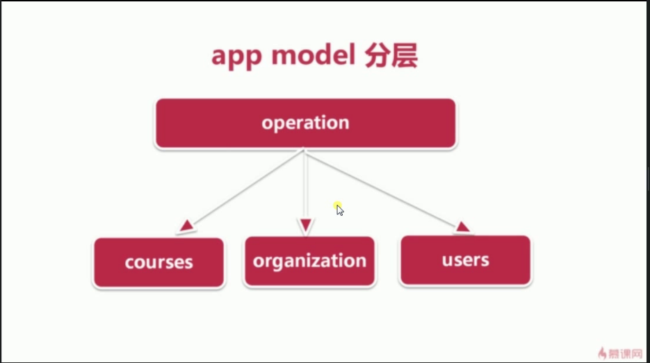

## Python + Django 开发在线教育网站

### 超级管理员
    username admin
    password admin@7116
    
    root
    root@123

### 安装依赖包
    pip install -r requirements.txt

### 数据库设计
> - django app设计
> - users models.py的编写  
    - 1. 自定义userprofile覆盖默认user表  
    - 2. EmailVerifyRecord - 邮箱验证码  
    - 3. PageBanner - 轮播图  
    
> - courses models.py的编写  
    - 1.Course - 课程基本信息  
    - 2.Lesson - 章节信息  
    - 3.Video - 视频  
    - 4.CourseResource - 课程资源  
    
> - organization models.py的编写  
    - 1.CourseOrg - 课程机构基本信息  
    - 2.Teacher - 教师基本信息  
    - 3.CityDict - 城市信息  
    
> - operation models.py的编写  
    - 1.UserAsk - 用户咨询  
    - 2.CourseComments - 用户评论  
    - 3.UserFavorite - 用户收藏  
    - 4.UserMessage - 用户消息  
    - 5.UserCourse - 用户学习的课程  
    
#### 知识点
- 1.循环引用
> 
- 2.app model分层
> 
